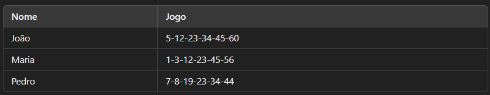
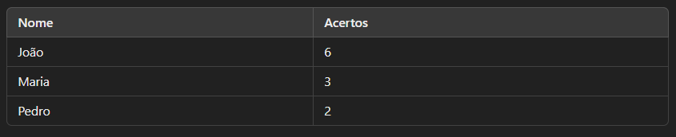

# 📊 Verificador de Bolão de Números

Este é um script Python para automatizar a verificação dos acertos de cada participante em um bolão de números (como Mega-Sena, por exemplo). A ferramenta lê uma planilha Excel com os jogos de cada participante e compara com os números sorteados, gerando um ranking de acertos.

## ✅ Funcionalidades

- Lê uma planilha Excel contendo os nomes dos participantes e seus jogos;
- Compara cada jogo com os números sorteados informados pelo usuário;
- Calcula a quantidade de acertos de cada participante;
- Gera um arquivo `resultado_bolao.xlsx` com o ranking dos participantes.

## 📁 Estrutura da Planilha de Entrada (`jogos.xlsx`)

O arquivo Excel deve conter duas colunas obrigatórias:

<p align="center">
    
</p>

- **Nome:** Nome do participante
- **Jogo:** Números apostados separados por hífen (`-`)

## 🛠 Como Usar

1. Instale a dependência:

```python
pip install pandas openpyxl
```

2. Salve o script como `verificar_bolao`.py.
3. Certifique-se de ter o arquivo `jogos.xlsx` na mesma pasta.
4. Execute o script:

```python
python verificar_bolao.py
```

5. Digite os números sorteados separados por vírgula quando solicitado:

```python
Digite os números sorteados separados por vírgula: 5,12,23,34,45,60
```

6. O resultado será exibido no terminal e salvo em `resultado_bolao.xlsx`.

## 📈 Exemplo de Saída (`resultado_bolao.xlsx`)

<p align="center">
    
</p>

## ⚠ Observações

- Os jogos devem conter os números separados por hífen (`-`) na planilha.
- Os números sorteados devem ser informados separados por vírgula (`,`) no terminal.
- O arquivo de resultado será sobrescrito se já existir.

## 🖥 Requisitos

- Python 3.x
- pandas
- openpyxl (para salvar o resultado em Excel)

## 📄 Licença

Este projeto é de uso livre para fins educacionais ou pessoais.
